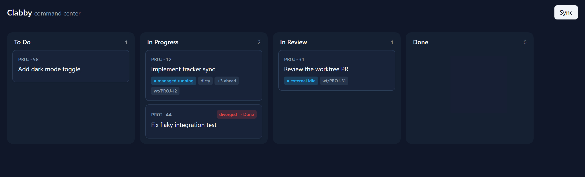

# Clabby

A **local command center** for agent-assisted software work: a dashboard that keeps
an overview of many concurrent work streams (multiple agents, terminals, git
worktrees, issues in flight), synced to your issue tracker, with a deterministic
workflow engine that guarantees the mandatory steps happen — while you stay in the
loop.

Clabby is **not** an autonomous agent runner. It enforces your workflow; you do the
thinking. See [`CONSTITUTION.md`](./CONSTITUTION.md) for the principles that govern
every change.



> The board: columns are tracker statuses; each card surfaces the issue's live
> session, git, and worktree state, and an out-of-band tracker change is flagged as
> **diverged**. Shown with the offline demo data — regenerate with
> `pnpm --dir ui screenshot`.

## Status: Milestones 1–2 (headless command center + workflow engine)

Working today, fully headless via the CLI:

- **Tracker sync** — pull issues via a configurable command (your `acli`/`jira`/`gh`),
  with the tracker as the source of truth. External changes are detected and flagged
  as **diverged** rather than silently overwritten; your own pushes reconcile cleanly.
- **Sessions** — *managed* runs that Clabby spawns and streams, plus *external*
  interactive sessions you run yourself and attach for the overview.
- **Worktrees** — create per-issue git worktrees and surface their live git state.
- **Overview** — `clabby status` joins issues × sessions × git state into one view.
- **Cron** — keep the overview fresh on a schedule.
- **Deterministic transitions (M2)** — `clabby move <issue> <status>` runs that
  transition's configured steps in order under **gate-with-override**: a required step
  that fails blocks the move (the issue stays put, nothing downstream runs) until you
  fix it or `clabby override <issue> --reason "…"` — which records the reason (logged
  for debugging) and resumes. Steps are command templates or agent runs; `when` guards and
  best-effort hooks are supported.

Everything external is a **command template** — no tracker, VCS host, or agent is
hardcoded (Constitution §5, §11). The engine (`clabby-core`) has no UI dependency;
the CLI is a thin driver, and a Tauri + React board will be another (Milestone 3).

## Quickstart (offline demo, no credentials)

Requires the Rust toolchain and Node.js (the demo's fake tracker is a node script).

```sh
cargo build
cd examples/jira

# Pull issues from the (fake) tracker and show the board
../../target/debug/clabby sync
../../target/debug/clabby status

# Transition an issue from Clabby (pushes back to the tracker)
../../target/debug/clabby issue set-status PROJ-12 "In Review"

# Run a managed agent for an issue, streaming its output
../../target/debug/clabby session spawn PROJ-12 --agent echo

# Simulate someone else changing the tracker, then re-sync to see divergence
node ../tracker.mjs issues.json transition PROJ-44 "Done"
../../target/debug/clabby sync
../../target/debug/clabby status        # PROJ-44 shows "! diverged(->Done)"
```

`examples/github/` is the **same engine** driven by a deliberately different tracker
shape (top-level array, flat `state`, label objects) — proof that adopting a new
workflow needs config changes only, never code (Constitution §11).

## Commands

```
clabby sync                               Pull + reconcile issues from the tracker
clabby status [--watch]                   The overview dashboard
clabby issue set-status <KEY> <STATUS>    Push a status change to the tracker
clabby session spawn <KEY> --agent <A>    Spawn + stream a managed agent run
clabby session attach <KEY> --worktree P  Register an external interactive session
clabby session list                       List sessions
clabby worktree add <KEY> [--branch B]    Create a per-issue git worktree
clabby worktree list                      List recorded worktrees
clabby logs tail <SESSION_ID>             Recent log lines for a session
clabby cron run [--once]                  Run scheduled jobs (or each once)
clabby move <KEY> <STATUS>                Run a gated transition to a new status
clabby override <KEY> --reason "…"        Override a blocked step (audited) + resume
```

Config is discovered as `clabby.toml` from the current directory upward, or passed
with `--config`. See the examples for a documented schema.

## Testing

Tests are **black-box first** (Constitution §9): they drive the compiled binary and
assert only on exit codes and stdout/stderr, so the engine can be rewritten without
touching them.

- `crates/cli/tests/cmd/*.md` — **living documentation** via [`trycmd`]. The markdown
  transcripts (e.g. the command reference) are executed and checked against real output;
  if the CLI changes, the docs fail the build. Regenerate after an intentional change:
  `TRYCMD=overwrite cargo test -p clabby --test cli_docs`.
- `crates/cli/tests/cli_blackbox.rs` — functional + failure-mode coverage with
  [`assert_cmd`] and [`assert_fs`] (sync, divergence, sessions, worktrees, cron, and the
  error paths), each in an isolated temp sandbox.
- `crates/core/tests/e2e.rs` + module unit tests — the engine directly, against temp
  SQLite and temp git repos.

```sh
cargo test                 # everything
cargo test -p clabby-core  # the fast engine inner loop
```

Black-box tests require `node` and `git` on PATH (the offline fake tracker is a node
script; worktree tests use git).

[`trycmd`]: https://docs.rs/trycmd
[`assert_cmd`]: https://docs.rs/assert_cmd
[`assert_fs`]: https://docs.rs/assert_fs

## CI and local checks

CI (`.github/workflows/ci.yml`) runs four gates on every PR and push:

- **`fmt · clippy · test`** — `cargo fmt --check`, `cargo clippy --workspace
  --all-targets -- -D warnings`, and `cargo test --workspace`.
- **`coverage`** — `cargo llvm-cov --workspace --fail-under-lines 75`.
- **`build · e2e`** — the frontend `tsc`/`vite` build, Biome lint, and the Playwright
  board suite.
- **`tauri shell`** — compiles the Tauri desktop shell (kept outside the Cargo
  workspace) and clippies it.

Lints follow the default + `clippy::all` set with documentation/style nags allowed
(see the crate roots). Run the Rust gate locally before pushing:

```sh
./scripts/ci.ps1      # Windows / PowerShell
./scripts/ci.sh       # bash
just                  # if you `cargo install just`
```

Enable the auto-format pre-commit hook (runs `cargo fmt` + Biome on staged files so
formatting never breaks the build):

```sh
./scripts/install-hooks.ps1   # or ./scripts/install-hooks.sh
```

Development is **trunk-based**: branch, open a PR, and it auto-merges once all four
checks pass — see [`docs/trunk-based-development.md`](./docs/trunk-based-development.md).
(For running the real GitHub workflow locally, [`act`](https://github.com/nektos/act)
executes it in Docker.)

## Roadmap

- ✅ **M1 — headless command center** (sync, sessions, worktrees, overview, cron).
- ✅ **M2 — deterministic workflow engine:** gated `move`/`override`, with override
  reasons logged for debugging.
- 🚧 **M3 — Tauri + React board:** the desktop shell (real-time `EventBus` push) and a
  dnd-kit board — drag-to-transition, divergence flags, live session/git/worktree
  badges — under a Playwright suite. CI-gated by the `tauri shell` and `build · e2e` jobs.
- **Future — `clabby init --from-jira`:** bootstrap config from a live instance's
  custom statuses and labels.

See [`BACKLOG.md`](./BACKLOG.md) for consciously deferred work.
